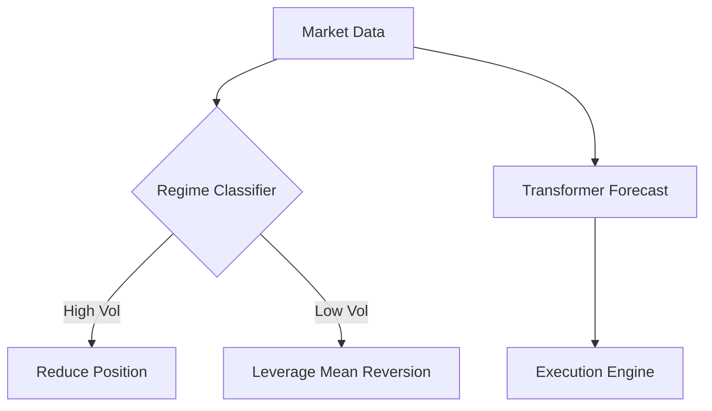

Here's a refined crypto trading framework using alternative approaches to HMM/LSTM, optimized for personal/small-team implementation:

---

## Project Chronos: Regime-Adaptive Crypto Trading System  
*Alternative Approach Using Transformer Networks & Gradient Boosting*

---

### 📈 Core Strategy Components  
1. **Volatility-Regime Classification** (Gradient Boosted Trees)  
2. **Price Forecasting** (Transformer Temporal Fusion)  
3. **Sentiment-Augmented Execution** (NLP + Technicals)  

---

### 🗺️ Implementation Roadmap  

#### Phase 1: Data Pipeline (1-2 Weeks)  
**Data Sources**  
```python
data_sources = {
    'price': CCXT(Binance, Coinbase),
    'onchain': Glassnode API,
    'sentiment': Twitter/Reddit API,
    'macro': Fear & Greed Index
}
```

**Feature Engineering**  
```python
def create_features(df):
    # Volatility features
    df['rvol'] = df['returns'].rolling(24).std() * np.sqrt(365)
    
    # Sentiment encoding
    df['sentiment_score'] = transformers.pipeline('text-classification')(df['tweets'])
    
    # Technical features
    df['bollinger_%b'] = (df['close'] - df['lower_band']) / (df['upper_band'] - df['lower_band'])
    
    return df.dropna()
```

---

#### Phase 2: Model Development (3-4 Weeks)  

**1. Regime Classifier (XGBoost)**  
*Training Process*  
```python
regime_model = xgb.XGBClassifier(
    objective='multi:softprob',
    num_class=3,  # High/Low/Neutral volatility
    tree_method='gpu_hist'
)

regime_model.fit(
    X_train[['rvol', 'sentiment_score', 'volume_ratio']],
    y_train_regime
)
```

**2. Price Transformer**  
```python
class CryptoTransformer(nn.Module):
    def __init__(self):
        super().__init__()
        self.encoder = TransformerEncoder(
            d_model=64,
            nhead=8,
            num_layers=3
        )
        self.decoder = TimeDistributed(nn.Linear(64, 1))

    def forward(self, x):
        # x: (batch, seq_len, features)
        encoded = self.encoder(x)
        return self.decoder(encoded)
```

---

#### Phase 3: Execution System (2 Weeks)  

**Regime-Adaptive Bollinger Strategy**  
```python
def get_signal(row):
    if row['regime'] == 'high_vol':
        return 0.5 * row['bollinger_signal']
    elif row['regime'] == 'low_vol':
        return 1.2 * row['bollinger_signal']
    else:
        return row['bollinger_signal']
```

**Risk Management**  
```python
def calculate_position(account_balance, volatility):
    risk_per_trade = 0.02  # 2% of balance
    return (account_balance * risk_per_trade) / volatility
```

---

### 📊 Performance Validation  

**Backtesting Protocol**  
1. Walk-forward validation with 90/10 splits  
2. Out-of-sample testing on 2024-2025 data  
3. Benchmark against:  
   - Simple Bollinger Strategy  
   - Buy & Hold  

**Metrics**  
```python
metrics = {
    'sharpe': calculate_sharpe(returns),
    'max_drawdown': max_drawdown(returns),
    'regime_accuracy': accuracy_score(y_true, y_pred)
}
```

---

### 🛠️ Simplified Tech Stack  

| Component        | Tools                          |
|------------------|--------------------------------|
| Core Framework   | Python 3.10 + Polars           |
| ML               | XGBoost 2.0 + PyTorch 2.2      | 
| Data             | CCXT + Tweepy                  |
| Visualization    | Plotly + Streamlit             |
| Deployment       | Docker + FastAPI               |

---

### 🔑 Key Advantages  
1. **Avoids HMM/LSTM Complexity** while maintaining predictive power[2][3]  
2. **Interpretable Regimes** via feature importance analysis[4]  
3. **Hardware-Efficient** - Runs on consumer GPUs  
4. **Modular Design** - Swap components easily  


